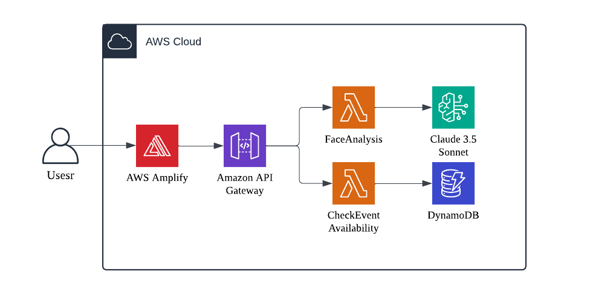

> <div style="color: #007EB9;">
> 
> ## README created by Amazon Q Developer
> </div>
> For more Amazon Q Developer's new feature: https://aws.amazon.com/blogs/aws/new-amazon-q-developer-agent-capabilities-include-generating-documentation-code-reviews-and-unit-tests/
&nbsp;
# Amazon Bedrock Face Analysis Web Application

This project is a web application that uses Amazon Bedrock to analyze facial features based on user-uploaded photos.

The application consists of a React-based frontend that allows users to capture photos using their mobile device's camera or enter an event code on desktop. The captured images are then sent to a backend API for analysis using Amazon Bedrock's AI capabilities.

## Repository Structure

```
.
├── package.json
├── public
│   ├── index.html
│   └── manifest.json
├── README.md
└── src
    ├── App.css
    ├── App.jsx
    ├── App.test.js
    ├── components
    │   ├── desktop
    │   │   ├── DesktopView.jsx
    │   │   └── styles.js
    │   └── mobile
    │       ├── AnalysisResult.jsx
    │       ├── Camera.jsx
    │       ├── MobileView.jsx
    │       └── styles.js
    ├── config
    │   └── index.js
    ├── index.css
    └── index.js
```

### Key Files:

- `src/index.js`: The entry point of the React application.
- `src/components/mobile/MobileView.jsx`: Handles the mobile view of the application, including camera functionality and result display.
- `src/components/mobile/AnalysisResult.jsx`: Renders the analysis results received from the backend.
- `src/components/mobile/Camera.jsx`: Manages the camera interface for capturing photos.
- `src/components/desktop/DesktopView.jsx`: Handles the desktop view, including event code input and QR code generation.
- `src/config/index.js`: Contains configuration settings, including the API endpoint.

## Usage Instructions

### Prerequisites

- Node.js (version 14 or higher)
- npm (version 6 or higher)

### Installation

1. Clone the repository:
   ```
   git clone <repository-url>
   ```

2. Navigate to the frontend directory:
   ```
   cd frontend
   ```

3. Install dependencies:
   ```
   npm install
   ```

### Configuration

Set the `REACT_APP_API_ENDPOINT` environment variable in /src/config/index.js to your  API Gateway endpoint. If not set, it will default to `'https://nc009yrm00.execute-api.us-east-1.amazonaws.com/prod'`.

### Running the Application

1. Start the development server:
   ```
   npm start
   ```

2. Open a web browser and navigate to `http://localhost:3000`.

### Usage

#### Desktop View:
1. Enter the event code provided by the organizer.
2. If valid, a QR code will be displayed.
3. Use a mobile device to scan the QR code to access the mobile view.

#### Mobile View:
1. Grant camera permissions when prompted.
2. Capture a photo using the camera interface.
3. Wait for the analysis results to be displayed.
4. Review the facial analysis results, including face shape, features, and overall analysis.
5. Use the "Retake Photo" button to capture a new image if desired.

### Testing

Run the test suite with:
```
npm test
```

### Troubleshooting

1. Camera Access Issues:
   - Ensure that your browser has permission to access the camera.
   - If using HTTPS, make sure your SSL certificate is valid.
   - Problem: "無法存取相機，請確認已授予相機權限" (Unable to access camera, please confirm camera permissions are granted)
   - Solution: Check browser settings and grant camera access permissions.

2. API Connection Errors:
   - Verify that the `REACT_APP_API_ENDPOINT` is correctly set.
   - Check your network connection.
   - Problem: "系統發生錯誤，請稍後再試" (System error occurred, please try again later)
   - Solution: Verify API endpoint configuration and network connectivity.

3. Event Code Issues:
   - Ensure you're entering a valid event code.
   - Problem: "無效的活動代碼" (Invalid event code)
   - Solution: Double-check the event code provided by the organizer.

4. Performance Optimization:
   - If experiencing slow image uploads, consider compressing images before sending to the API.
   - Monitor network requests in the browser's developer tools to identify bottlenecks.

## Data Flow

The application follows this data flow for facial analysis:

1. User enters an event code (desktop) or scans a QR code (mobile).
2. Mobile view is loaded, and camera access is requested.
3. User captures a photo using the mobile device's camera.
4. The captured image is converted to a base64 string.
5. The base64 image is sent to the API Gateway (`/analyze` endpoint) via a POST request and trigger a Lambda Function.
6. The backend processes the image using Amazon Bedrock's AI capabilities.
7. Analysis results are returned to the frontend.
8. Results are displayed to the user, showing face shape, features, and overall analysis.

```
[User] -> [Camera Capture] -> [Image Processing] -> [API Request] -> [Amazon Bedrock]
                                                                         |
[Display Results] <- [Parse Response] <- [Receive Analysis] <-------------
```

## Infrastructure

The frontend application is designed to work with a serverless backend infrastructure. While the specific backend implementation details are not provided in the given code, the application expects an API endpoint that can handle image analysis requests.

Key infrastructure components inferred from the frontend code:

1. API Gateway: The `config.apiEndpoint` suggests the use of API Gateway to handle HTTP requests.
2. Lambda Functions: The `/analyze` and `/checkEvent` endpoints likely trigger Lambda functions for processing.
3. Amazon Bedrock: Used for AI-powered facial analysis, as indicated by the application's purpose.

The frontend is hosted on AWS Amplify.

